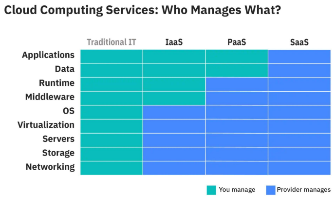

# IaaS, Paas, SaaS là gì?

Biểu đồ bên dưới sẽ minh hoạ sự khác nhau giữa IaaS (Infrastructure-as-a-Service), PasS (Platform-as-a-Service), và SaaS (Software-as-a-Service)

Với ứng dụng không được triển khai trên cloud, chúng ta sử hữu và quản lý toàn bộ cả phần cứng và phần mềm. Chúng ta gọi nó là on-premises.

Với triển khai trên cloud, nhà phân phối cung cấp ba loại cho chúng ta sử dụng: IaaS, PaaS, SaaS.

_IaaS_ cung cấp chúng ta quyền truy cập vào cơ sở hạ tần của nhà phân phối như server, storage, networking. Chúng ta trả tiền cho dịch vụ cơ sở hạ tầng, cài đặt và quản lý các phần mềm hỗ trợ cho ứng dụng của mình.

_PaaS_ cung cấp một nền tảng với các phần mềm hỗ trợ trung gian, frameworks, và các công cụ để xây dựng ứng dụng. Chúng ta chỉ cần tập trung vào việc phát triển ứng dụng và dữ liệu.

_SaaS_ cho phép ứng dụng chạy trên cloud. Chúng ta trả tiền hàng tháng hoặc hàng năm để sử dụng.
