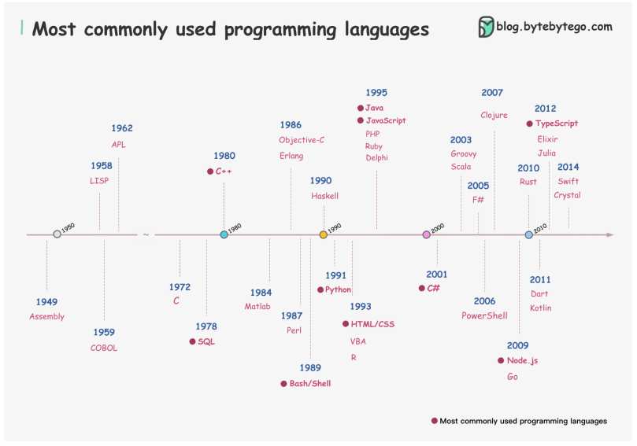

# Các ngôn ngữ lập trình phổ biến.

Ngôn ngữ lập trình có rất nhiều, một vài vẫn đang trong giao đoạn thử nghiệp. Một vài đã sẵn sàng và tiếp tục phát triển.

Tôi vẽ một biểu đồ bao gồm 38 ngôn ngữ lập trình thường dùng được sắp xếp theo năm, dữ liệu lấy từ bài khảo sát của StackOverflow.

1. JavaScript
2. HTML/CSS
3. Python
4. SQL
5. Java
6. Node
7. TypeScript
8. C
9. Bash/Shell
10. C
11. PHP
12. C
13. PowerShell
14. Go
15. Kotlin
16. Rust
17. Ruby
18. Dart
19. Assembly
20. Swift
21. R
22. VBA
23. Matlab
24. Groovy
25. Objective-C
26. Scala
27. Perl
28. Haskell
29. Delphi
30. Clojure
31. Elixir
32. LISP
33. Julia
34. F
35. Erlang
36. APL
37. Crystal
38. COBOL