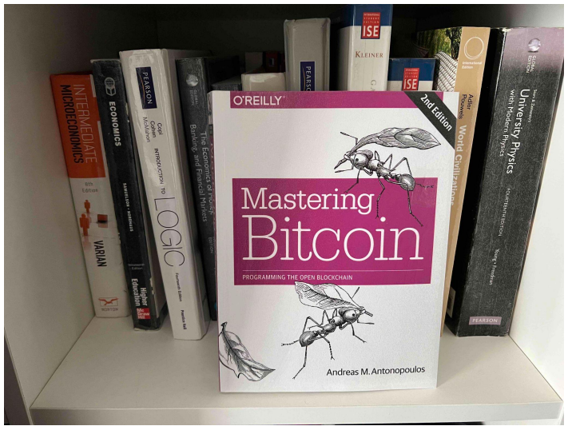

# Tương lai của thanh toán online?

Tôi không biết câu trả lời là gì, nhưng tôi biết một ứng cử viên là blockchain.

Là một fan của công nghệ. Tôi luôn tìm kiếm những cách giải quyết mới cho tới những thử thách cũ. Một quyển sách giải thích cho tôi rất nhiều thứ về hệ thống thanh toán mới nổi lên là 'Mastering Bitcoin' bởi Andreas M. Antonopoulos. Tôi muốn chia sẻ trải nghiệm của tôi về quyển sách này tới bạn bởi vì nó giải thích rất ngắn ngọn về bitcoin và cơ bản về blockchain. Quyển sách này khiến tôi phải nghĩ lại về cách đổi mới hệ thống thanh toán.

Đây là những điều được rút ra

1. Số dư trong vì bitcoin được tính toán ngay lập tức, khi giao dịch được lưu lại trên cơ sở dữ liệu. Bạn có thể đọc tại chapter 12 của System Design Interview Volume 2, về việc làm cách nào để triển khai một hệ thống giao dịch.
2. Một thứ giúp xác thực về độ đáng tin cậy